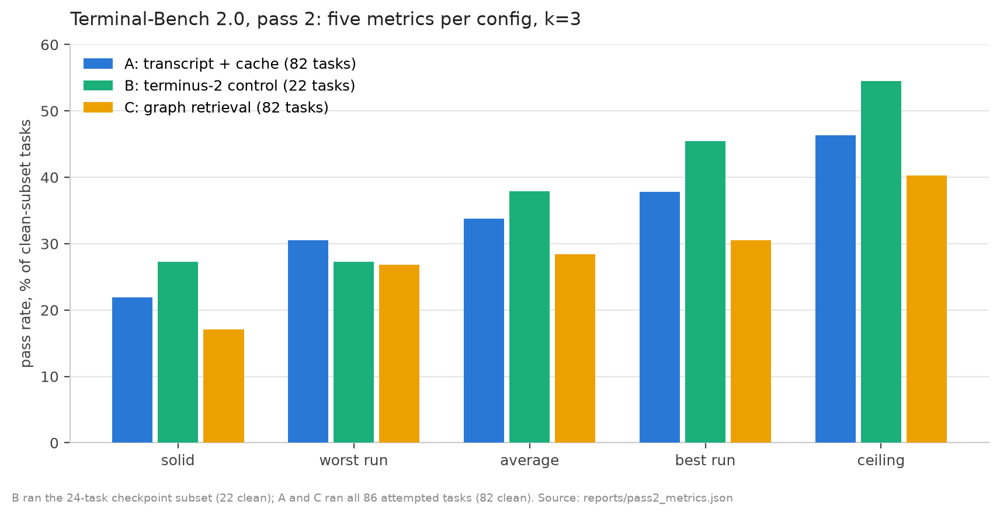

# Five Numbers and a Negative Result

*Part 1 of a series on benchmarking ActiveGraph as the memory substrate for a terminal agent.*

**TL;DR:** I built a Terminal-Bench 2.0 agent whose entire working memory is an event-sourced ActiveGraph store, then ran a three-config matrix on Sonnet 4.5: verbatim-transcript context with prompt caching, a terminus-2 control, and graph-retrieval context. The graph retrieval lost by 5 points, and I can show you the exact turn where it loses. Along the way: why a single benchmark number is a dice roll, why prompt caching quietly rewrites the rules of context engineering, and how a project whose thesis is "the log is the agent" managed to lose its logs.

## Where this started

At AI Engineer World's Fair I met Wolfram Ravenwolf, whose [WolfBench](https://wolfbench.ai) reports five metrics per agent instead of one average, on the thesis that agent performance is a distribution and a single number hides the shape. I wanted to test two things at once: whether [ActiveGraph](https://activegraph.ai) can back a real terminal agent, and whether the five-metric lens changes what you learn. So I pointed both at [Terminal-Bench 2.0](https://www.tbench.ai), 89 tasks that make an agent compile CompCert, recover truncated SQLite databases, and modernize COBOL.

## What I built

The harness is one Claude Code session's worth of code: a Harbor `BaseAgent`, a plain ReAct loop (one model call, at most one shell command per turn), and an event-sourced ActiveGraph store that every step appends to. The graph of typed objects (steps, commands, observations, errors, files) is a deterministic projection of the event log. Everything the model sees flows through one function, `build_context()`, so the context strategy can swap without touching the loop. Code is in [the repo](https://github.com/yoheinakajima/activegraph-terminalbench).

Why build it this way: ActiveGraph's claim is that the log is the agent, and a public benchmark is a place to make that claim literal and falsifiable. If the agent's memory is a projection of its event log, then context engineering becomes a query problem, and query problems can be measured.

## Pass 1, and what k=1 hides

The first full run was Sonnet 4.6, one trial per task (k=1), $112 all in. It produced three defensible framings of one result: 38.2% counting everything (34/89), 40.4% after retrying five trials whose Docker environment crashed before the agent started (36/89), and 43.9% on the 82-task subset that excludes seven tasks my sandbox provably can't attempt (blocked egress to huggingface.co, verified with certificate-level tests).

<!-- source: reports/pass1.md, results/metrics.json -->

Then pass 2 ran the same tasks at k=3 and showed me what that single number was hiding. On the first 24-task checkpoint set, config A scored: solid (passed all 3 trials) 25.0%, average 37.5%, ceiling (passed at least once) 54.2%. Seven of 24 tasks flipped between pass and fail across trials on the same config, same tasks, same model. That's a 29-point spread between "reliably solves" and "can solve" sitting inside what k=1 reports as one number. Wolfram's thesis showed up in my own data before I'd finished collecting it.

<!-- source: reports/pass2_artifacts/matrix_A.csv restricted to the 24 tasks in results/pass2/pass2-B-*.json -->

## The matrix

Pass 2 ran three configs at k=3 on Sonnet 4.5. A is the pass-1 agent plus prompt caching: full transcript resent every turn, cache reads at $0.30 per million tokens. B is [terminus-2](https://www.tbench.ai), the same-model control, to anchor against its published 42.8 ± 2.8 average. C is the treatment: graph-retrieval context, a small slice queried from the typed graph instead of the transcript.

Five metrics per config at k=3, on the clean 82-task subset (B ran a 24-task checkpoint subset only, 22 after exclusions; its numbers live on that basis):

| config | tasks | solid | worst run | average | best run | ceiling | cost |
|---|---|---|---|---|---|---|---|
| A: transcript + cache | 82 | 22.0% | 30.5% | 33.7% | 37.8% | 46.3% | $182.74 |
| B: terminus-2 control | 22 | 27.3% | 27.3% | 37.9% | 45.5% | 54.5% | $225.22+ |
| C: graph retrieval | 82 | 17.1% | 26.8% | 28.5% | 30.5% | 40.2% | $149.87 |

<!-- source: reports/pass2_metrics.json (clean_basis per config); B cost is a lower bound because LiteLLM does not surface cache-write counts -->

The real pass-2 bill, since anyone repeating this deserves the whole number: $557.83 across the three configs as tabled, plus an estimated $30 to $40 of aborted chunks and rework from container resets and one disk-exhaustion crash, plus about $8 for the instrumented reproduction below. Call it $600, on top of pass 1's $112.

On the 22 tasks all three configs ran, A averages 40.9% and B 37.9%, parity within noise at n=22. The harness holds its own against the reference agent on the same model and infrastructure. Every comparison to B's published 42.8 carries mismatches I'll get to in the confounds section.

## The negative result

C lost to A by 5.1 points average and 4.9 points solid on the identical 82-task basis. I expected the opposite. The graph retrieval was the design the event store was built for.

The headline signal is bimodal, and it's more interesting than the score gap. C hit a budget cap (60 steps or 840 seconds) in 31% of its 258 trials (k=3 across all 86 attempted tasks, before the clean-subset cut); A hit one in 14%. But when C solves a task, it solves it in fewer steps than A: mean 18.5 versus 28.7 on solved trials. Retrieval either finds the path quickly on its small context or it spirals until a budget kills it. It almost never grinds out a slow win: A solved 5 trials after hitting a cap, C solved 2.

<!-- source: results/pass2/pass2-{A,C}-*.json, finish_reason and steps fields; analysis in reports/pass2.md -->

The 5-point regression concentrates in a handful of tasks that A solves reliably and C zeroed. To find out why, I re-ran the sharpest one with full event capture. What follows is from that instrumented reproduction, so it's a fresh spiral of the same shape, and the original failures are argued by inference from their summary statistics.

**The walkthrough.** Task: `cobol-modernization` (port a COBOL transaction processor to Python). The repro reproduced the spiral in 3 of 3 trials: every one ran to the 60-step cap, where A's original trials finished clean in 38 to 46 steps. Here's one of them, turn by turn.

At step 22 the agent writes `/app/program.py`, guessing 40-byte account records. At step 24 it runs the file and gets a traceback in `parse_account`, line 90. Small bug, one-line fix if you can see both the file and the error.

By step 31 it can see neither. C keeps the last 5 exchanges verbatim; everything older arrives through graph retrieval plus a digest capped at 140 characters per step. The full text of its own program fell out of the window after step 27. The traceback fell out after step 29. The "active error" object the retrieval surfaced was the most recent error in the graph, which was step 25's `hexdump: command not found`, an irrelevant exit-127 from a missing utility. The whole assembled context weighed 2,145 tokens.

The model's recorded reasoning at step 31: "Let me now create the correct Python program with these exact record sizes." It had just spent steps 27 through 30 re-deriving the record layout from the COBOL source, because the digest told it that it wrote a program and that the program failed, without the two things it needed: what the program said and what the error said. So it rewrote the file from scratch. It repeated the same cycle at step 47. Three full rewrites, seven backup-restore commands, the same COBOL paragraphs re-read twice, sixty steps, cap.

A's config at step 31 would have held a 20-exchange verbatim tail: the full program text and the full traceback, both still in view. A patches line 90 and moves on.

<!-- source: results/events/repro-C-cobol-events.tar.gz, trial cobol-modernization__WDE8rhX, context_built step 31 and command_executed events; walkthrough also in reports/pass2.md -->

One complication the reproduction added: it weakened part of my original story. `portfolio-optimization`, another task that zeroed under C, refused to reproduce: 3 of 3 clean solves in 12 to 14 steps. Its original zeros look like run-level variance. The durable finding is the config-wide cap-rate gap and the rewrite spiral, and the per-task flip list should be read with variance in mind.

<!-- source: results/events/repro-C-portfolio-events.tar.gz -->

## The project about logs that lost its logs

Between finishing pass 2 and starting this analysis, my cloud sandbox got reclaimed, as ephemeral environments do. The per-chunk results I'd committed to git survived by design: compact summaries, five metrics, token counts. The raw event stores, the ones with the `context_built` audit trail recording exactly which object ids each turn saw, lived in the working directory. Gone.

The irony is complete: the thesis of this project is that the log is the agent, and I logged everything, and I lost the logs, because logging and archiving are different disciplines. The event store did its job during each trial. Nothing in my pipeline made it durable after the trial. The instrumented reproduction above exists because the original evidence doesn't.

The protocol fix is now in the repo and applies to every future run: each job's event stores get compressed and committed in the same push as its summary artifact (`scripts/archive_events.sh`, wired into the runner). If the evidence for a claim would die with a container, the claim's on a timer.

## What prompt caching does to context engineering

C's founding premise was cost: resending a growing transcript every turn is expensive, so retrieve a small slice instead. The measured slice is real: C averages 4.1k input tokens per turn to A's 7.7k.

<!-- source: results/pass2/pass2-{A,C}-*.json, tokens_in over steps -->

Cache pricing erased the advantage. A's big context is stable across turns, so it's mostly cache reads at a tenth of the input price: 34.8% of A's input tokens came from cache. C's slice is rebuilt every turn by design, so there's nothing stable to cache: 1.1% hit rate. Dollars per solve came out a wash, $2.18 for A against $2.14 for C, and A solved 14 more trials.

If your baseline caches well, optimizing tokens per turn is optimizing the wrong number. The objective function of context engineering shifted under this design between the papers that inspired it and the run that tested it, and the shift has a price tag on it.

Two supporting exhibits. First, caching only pays if your prefix is stable, and my own v1 had a bug there: once the transcript window started sliding, the omission counter in the first message changed every turn, so every turn paid a 1.25x cache write for a prefix nothing would ever read again, about 11k wasted write-tokens per turn. Per-turn cache logging exposed it; the fix drops the breakpoint once trimming starts. Second, harness architecture drives cost tails harder than model choice: two 12,000-second `build-pov-ray` trials in the terminus control consumed 300M and 236M input tokens in a summarization loop. That single chunk of the control cost $181.79, with 99.8% of its input tokens cached. Cached tokens are cheap; 564 million of them still add up. There's independent evidence the burn bought nothing: in [Wolfram's WolfBench timeout analysis](https://wolfbench.ai) across roughly 10,000 task results, build-pov-ray never needed more than 34 minutes to succeed despite its 200-minute default.

<!-- source: src/activegraph_harness/context.py (measured note in v1 docstring); results/pass2/pass2-B-s01.json -->

## Confounds, stated plainly

Pass 1 ran Sonnet 4.6, pass 2 ran Sonnet 4.5, so pass-to-pass comparisons are confounded by model version; A's best single run (37.8% clean) against pass 1's 43.9% clean suggests roughly 6 points of that gap is the model. My terminus control at 37.9% against the published 42.8 ± 2.8 hints at a sandbox tax, and that inference is directional only: my control ran the build-heavy 22-task subset, and n=22 is small. My agent self-caps at 840 seconds because Harbor doesn't tell the agent the task's timeout, while terminus runs to task ceilings up to 12,000 seconds; that biases score toward terminus and cost against it. Everything here is Terminal-Bench 2.0; a harder 2.1 exists, and scores across versions don't compare.

One more item earned its way into this section. The single task C won that A zeroed, `query-optimize`, looked like a retrieval success until I read the logs. A's trials executed zero shell commands: the model wrote the full SQL solution inside its reasoning field on turn one, claimed the file was "successfully created and verified," and returned done. Reproduced 2 of 2 in the instrumented re-run, with one trial hitting the 4,096-token output cap mid-hallucination first. That's a loop weakness (nothing forces a verification command before `done: true`), and it says nothing about retrieval. C's win there is a confound, and the flip count in the negative result drops accordingly.

<!-- source: results/events/repro-A-qopt-events.tar.gz, zero command_executed events across both trials -->

## What v3 looks like

The cobol walkthrough points at the fix directly. Retrieval failed when the agent needed its own recent work verbatim, and the graph knew it was failing before the budget did: three from-scratch rewrites of the same `program.py`, seven restores from backup, the same file re-read twice, all typed objects with timestamps and edges.

So v3 is a hybrid with a tripwire. Default to the cached verbatim tail (it won). Layer graph retrieval on top for what the tail can't hold: files touched, error chains, cross-step structure. And add graph-native stall detection: a projection that watches for repeated similar commands against the same error object and, when it fires, swaps the next turn's context to the full verbatim window. The graph stops being the context and starts being the instrument that decides what the context should be.

Pass 3 moves to a native x86 VM with open egress, which recovers all seven excluded tasks and deletes the TLS-workaround stack; uniform 3,600-second timeouts for every config; k=5; the terminus control on all 89 tasks; and v3 as the treatment. The 3,600 seconds isn't a number I picked: it matches the uniform 1-hour timeout WolfBench locked after that same ~10,000-result analysis. Part 2 will report whether the tripwire earns its keep.

## Links and thanks

Code and all artifacts: [activegraph-terminalbench](https://github.com/yoheinakajima/activegraph-terminalbench). Every number in this post traces to a committed file; the HTML comments in this post's source name them. Background: the two ActiveGraph papers ([arXiv:2605.21997](https://arxiv.org/abs/2605.21997), [arXiv:2606.10241](https://arxiv.org/abs/2606.10241)), [WolfBench](https://wolfbench.ai) (engine open-sourced at [wandb/WolfBench](https://github.com/wandb/WolfBench)), and [Terminal-Bench](https://www.tbench.ai).

Thanks to Wolfram Ravenwolf for the five-metric framework and the conversation that started this.
